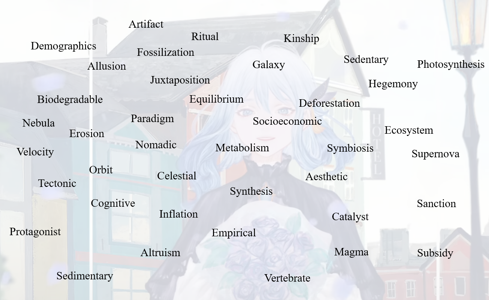

## TOEFL外刊网站

托福阅读文章的特点是：**学术性强、结构严谨、话题广泛、语言客观中立**
>（尤其偏爱生命科学、自然科学、历史考古、艺术等）
***
[1.Smithsonian magazine(极力推荐)](https://www.smithsonianmag.com/)

标准的北美学术英语(词汇/描述等完整补充)

[Smithsonian magazine archaeology](https://www.smithsonianmag.com/category/archaeology/)
>
[Smithsonian magazine science](https://www.smithsonianmag.com/category/science-nature/)
>
[Smithsonian magazine art&culture](https://www.smithsonianmag.com/category/arts-culture/)
***

[2.https://www.sciencenews.org/(极力推荐)](https://www.sciencenews.org/)

以通俗易懂的方式解释科学信息,在考察非专业背景学生对学术文章理解能力的目标一致

[sciencenews life science](https://www.sciencenews.org/topic/life)

[sciencenews Earth & Environment science](https://www.sciencenews.org/topic/earth)

[sciencenews Humans science](https://www.sciencenews.org/topic/humans)
***
[3.BBC](https://www.bbc.com/news)

语言质量很高但为英式英语,且文章风格更偏向教科书式的陈述,重点放在积累话题知识和词汇上

[BBC science](https://www.bbc.com/innovation/science)

[BBC Future](https://www.bbc.com/innovation/technology)

[BBC Earth](https://www.bbc.com/future-planet)

[BBC Culture/Travel(archaeology)](https://www.bbc.com/travel)
***
[4.National geographic Science](https://www.nationalgeographic.com/science/)
***
[5.Time Magazine Science](https://time.com/section/science/)
***
[6.Britannica](https://www.britannica.com/)
>数据库,根据托福的热门话题进行主题式搜索,深入了解某个你不熟悉的学术概念
***
**高难网站**

[1.Scientificamerican](https://www.scientificamerican.com/)

[2.economist](https://www.economist.com/)

[3.aeon](https://aeon.co/)

***
## 参考网站
[magoosh TOEFL Blog](https://magoosh.com/toefl/use-mental-floss-for-toefl-practice/)

